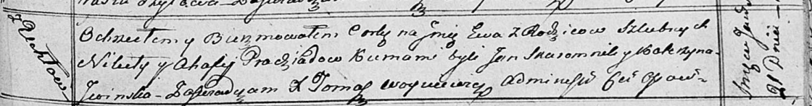

**Прадед Ева Микитова (Pradziadowna Ewa)**

21 января 1817 г -- крещение (НИАБ 136-13-894, лист 95, №5/1817-р
(ориг)).

**НИАБ 136-13-894:** Лист 95. **Метрическая запись №5/1817-р (ориг).**

Осовская Покровская церковь. 21 января 1817 года. Метрическая запись о
крещении.

Pradziadowna Ewa -- дочь родителей с деревни Углы.

Pradziad Nikita -- отец.

Pradziadowa Ahafija -- мать.

Skaromnik Jan -- кум.

Jwinska Katerzyna -- кума.

Woyniewicz Tomasz -- ксёндз.
