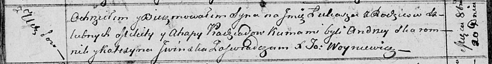

**Прадед Микита (Pradziad Mikita, Nikita)**

20 октября 1813 г -- крещение сына Лукаша (НИАБ 136-13-894, лист 87об,
№32/1813-р (ориг)).

21 января 1817 г -- крещение дочери Евы (НИАБ 136-13-894, лист 95,
№5/1817-р (ориг)).

**НИАБ 136-13-894:** Лист 87об. **Метрическая запись №32/1813-р
(ориг).**

Осовская Покровская церковь. 20 октября 1813 года. Метрическая запись о
крещении.

Pradziad Łukasz -- сын родителей с деревни Углы.

Pradziad Mikita -- отец.

Pradziadowa Ahapa -- мать.

Skaromnik Andrzey -- кум.

Jwinska Katerzyna -- кума.

Woyniewicz Tomasz -- ксёндз.

**НИАБ 136-13-894:** Лист 95. **Метрическая запись №5/1817-р (ориг).**

Осовская Покровская церковь. 21 января 1817 года. Метрическая запись о
крещении.

Pradziadowna Ewa -- дочь родителей с деревни Углы.

Pradziad Nikita -- отец.

Pradziadowa Ahafija -- мать.

Skaromnik Jan -- кум.

Jwinska Katerzyna -- кума.

Woyniewicz Tomasz -- ксёндз.
