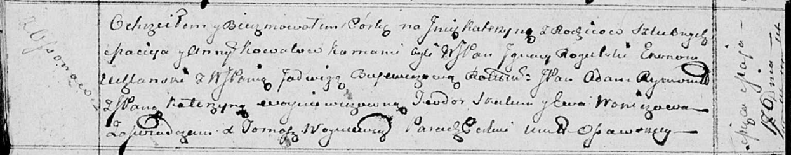

**Рогульский Игнацы, шляхтич (Rohulski Jgnacy)**

17 мая 1814 г -- крестный отец у Катерыны, дочери Ковалей Мацея и Анны с
деревни Осово (НИАБ 136-13-894, лист 89об, №30/1814-р (ориг)).

**НИАБ 136-13-894:** Лист 89об. **Метрическая запись №30/1814-р
(ориг).**

Осовская Покровская церковь. 17 мая 1814 года. Метрическая запись о
крещении.

Kowałowna Katerzyna -- дочь родителей с деревни Осовo.

Kował Maciey -- отец.

Kowałowa Anna -- мать.

Rohulski Jhnacy, WJP -- кум, шляхтич, эконом Углянский?.

Bujewiczowa Jadwiga, WJP -- кума, шляхтянка.

Rymond? Adam, JP -- ассистент, шляхтич.

Woyniewiczowna Katerzyna, JP -- ассистентка, шляхтянка.

Skakun Teodor -- ассистент.

Woniczowa Ewa -- ассистентка.

Woyniewicz Tomasz -- ксёндз.
