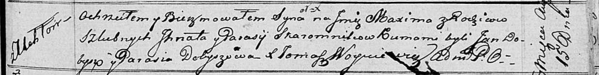

**Скаромник Максим Игнатов (Skaromnik Maxim)**

15 августа 1816 г -- крещение (НИАБ 136-13-894, лист 94, №23/1816-р
(ориг)).

**НИАБ 136-13-894:** Лист 94. **Метрическая запись №23/1816-р (ориг).**

Осовская Покровская церковь. 15 августа 1816 года. Метрическая запись о
крещении.

Skaromnik Maxim -- сын родителей с деревни Углы.

Skaromnik Jhnat -- отец.

Skaromnikowa Parasia -- мать.

Dobysz Jan -- кум.

Dobyszowa Parasia -- кума.

Woyniewicz Tomasz -- ксёндз.
