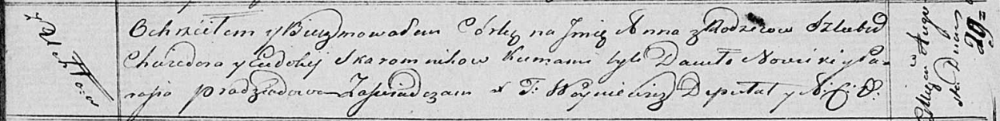

**Скаромник Хведор (Skaromnik Chwiedor)**

29 августа 1820 г -- крещение дочери Анны (НИАБ 136-13-894, лист 104об,
№28/1820-р (ориг)).

**НИАБ 136-13-894:** Лист 104об. **Метрическая запись №28/1820-р
(ориг).**

{width="6.496527777777778in"
height="0.7898556430446194in"}

Осовская Покровская церковь. 29 августа 1820 года. Метрическая запись о
крещении.

Skaromnikowna Anna -- дочь родителей с деревни Углы.

Skaromnik Chwiedor -- отец.

Skaromnikowa Eudokija -- мать.

Nowicki Daniło -- кум.

Pradziadowa Parasia -- кума.

Woyniewicz Tomasz -- ксёндз.
