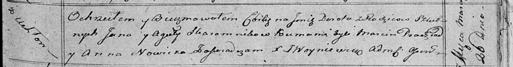

**Скаромник Дорота Янова (Skaromnikowna Dorota)**

26 марта 1816 г -- крещение (НИАБ 136-13-894, лист 93, №4/1816-р
(ориг)).

**НИАБ 136-13-894:** Лист 93. **Метрическая запись №4/1816-р (ориг).**

Осовская Покровская церковь. 26 марта 1816 года. Метрическая запись о
крещении.

Skaromnikowa Dorota -- дочь родителей с деревни Углы.

Skaromnik Jan -- отец.

Skaromnikowa Agata -- мать.

Pradziad Marcin -- кум.

Nowicka Anna -- кума.

Woyniewicz Tomasz -- ксёндз.
