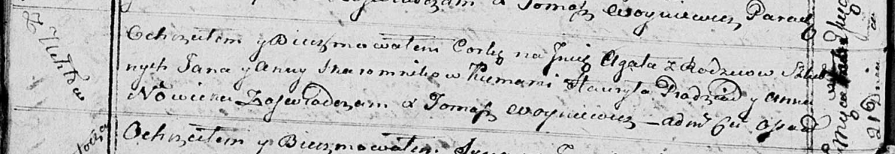

**Скаромник Агата Янова (Skaromkowna Agata)**

21 февраля 1815 г -- крещение (НИАБ 136-13-894, лист 91об, №8/1815-р
(ориг)).

Лист 91об. **Метрическая запись №8/1815-р (ориг).**

Осовская Покровская церковь. 21 февраля 1815 года. Метрическая запись о
крещении.

Skaromnikowna Agata -- дочь родителей с деревни Углы.

Skaromnik Jan -- отец.

Skaromnikowa Anna -- мать.

Pradziad Hauryła -- кум.

Nowicka Anna -- кума.

Woyniewicz Tomasz -- ксёндз.
