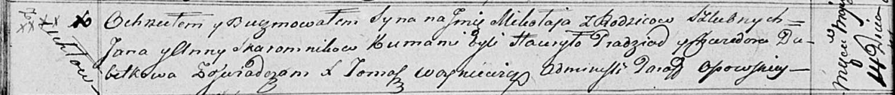

**Скаромник Анна (Skaromkowa Anna)**

30 марта 1812 г -- крещение сына Тодора (НИАБ 136-13-894, лист 84,
№23/1812-р (ориг)).

21 февраля 1815 г -- крещение дочери Агаты (НИАБ 136-13-894, лист 91об,
№8/1815-р (ориг)).

14 мая 1817 г -- крещение сына Миколая (НИАБ 136-13-894, лист 96об,
№33/1817-р (ориг)).

**НИАБ 136-13-894:** Лист 84. **Метрическая запись №23/1812-р (ориг).**

{width="6.496527777777778in"
height="0.8099704724409449in"}

Осовская Покровская церковь. 30 марта 1812 года. Метрическая запись о
крещении.

Skaromka Teodor -- сын родителей с деревни Углы.

Skaromka Jan -- отец.

Skaromkowa Anna -- мать.

Pradziad Hauryla -- кум.

Saukouna Anna -- кума.

Woyniewicz Tomasz -- ксёндз.

Лист 91об. **Метрическая запись №8/1815-р (ориг).**

{width="6.496527777777778in"
height="1.1230971128608924in"}

Осовская Покровская церковь. 21 февраля 1815 года. Метрическая запись о
крещении.

Skaromnikowna Agata -- дочь родителей с деревни Углы.

Skaromnik Jan -- отец.

Skaromnikowa Anna -- мать.

Pradziad Hauryła -- кум.

Nowicka Anna -- кума.

Woyniewicz Tomasz -- ксёндз.

**НИАБ 136-13-894:** Лист 96об. **Метрическая запись №33/1817-р
(ориг).**

{width="6.496527777777778in"
height="0.7000076552930884in"}

Осовская Покровская церковь. 14 мая 1817 года. Метрическая запись о
крещении.

Skaromnik Mikołay -- сын родителей с деревни Углы.

Skaromnik Jan -- отец.

Skaromnikowa Anna -- мать.

Pradziad Hawryła -- кум.

Dubetkowa Chwiedora -- кума.

Woyniewicz Tomasz -- ксёндз.
