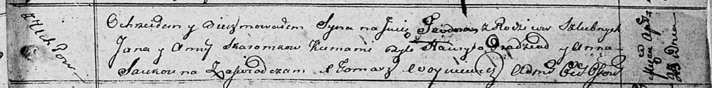

**Скаромник Тодор Янов (Skaromka Teodor)**

30 марта 1812 г -- крещение (НИАБ 136-13-894, лист 84, №23/1812-р
(ориг)).

**НИАБ 136-13-894:** Лист 84. **Метрическая запись №23/1812-р (ориг).**

{width="6.496527777777778in"
height="0.8099704724409449in"}

Осовская Покровская церковь. 30 марта 1812 года. Метрическая запись о
крещении.

Skaromka Teodor -- сын родителей с деревни Углы.

Skaromka Jan -- отец.

Skaromkowa Anna -- мать.

Pradziad Hauryla -- кум.

Saukouna Anna -- кума.

Woyniewicz Tomasz -- ксёндз.
