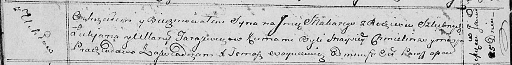

**Тарасевич Ульяна (Tarasewiczowa Ullana)**

25 января 1814 г -- крещение сына Макарыя (НИАБ 136-13-894, лист 88об,
№5/1814-р (ориг)).

**НИАБ 136-13-894:** Лист 88об. **Метрическая запись №5/1814-р (ориг).**

Осовская Покровская церковь. 25 января 1814 года. Метрическая запись о
крещении.

Tarasewicz Makary -- сын родителей с деревни Углы.

Tarasewicz Łukjan -- отец.

Tarasewiczowa Ullana -- мать.

Chmielinko Maysey -- кум.

Pradziadowa Marja -- кума.

Woyniewicz Tomasz -- ксёндз.
