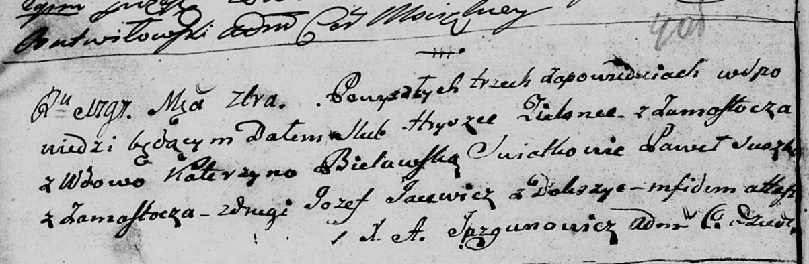

**Яцевич Иосиф (Jacewicz Jozef)**

Сентябрь 1797 г -- свидетель венчания Грышки Белявского с деревни
Замосточье с вдовой Катерыной Белявской (НИАБ 136-13-920, лист 4об,
№7/1797-б (ориг)).

**НИАБ 136-13-920:** Лист 4об. **Метрическая запись №7/1797-б (ориг).**

Дедиловичская Покровская церковь. Сентября 1797 года. Метрическая запись
о венчании.

Zielonka Hryszka -- жених, с деревни Замосточье.

Bielawska Katerzyna -- невеста, вдова.

Suszko Paweł -- свидетель, с деревни Замосточье.

Jacewicz Jozef -- свидетель, с местечка Докшицы.

Jazgunowicz Antoni -- ксёндз.
