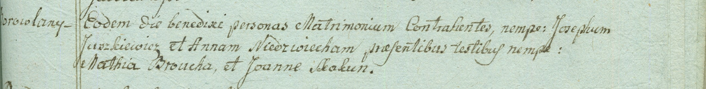

**Юшкевич (Недвецкая) Анна (Juszkiewiczowa Anna z Niedwieckich)**

24 октября 1798 г -- венчание с крестьянином Иосифом Юшкевичем с деревни
Боровляны (НИАБ 1781-27-199, лист 124, №3/1798-б).

**НИАБ 1781-27-199:** Лист 124. **Метрическая запись №3/1798-б.**

Дедиловичский костел Наисвятейшего Сердца Иисуса. 24 октября 1798 года.
Метрическая запись о венчании.

Juszkiewicz Joseph -- жених, крестьянин, с деревни Боровляны.

Niedwiecka Anna -- невеста, крестьянка.

Browka Mathiey -- свидетель.

Skakun Joann -- свидетель.

Linhart Hyacinthus -- ксёндз.
