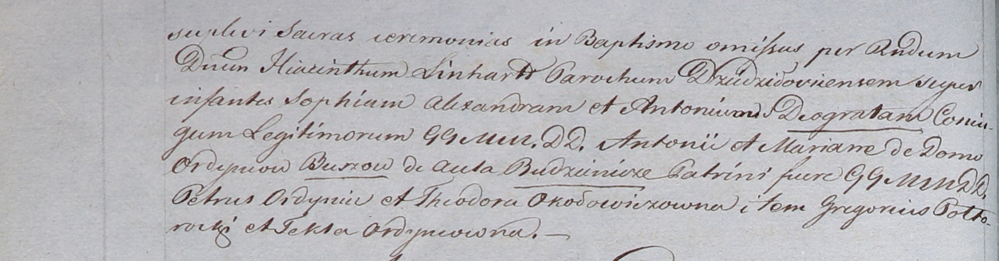

**Буш Антон Антонов (Busz Antoni Deograt)**

26 декабря 1807 г -- крещение (НИАБ 937-4-32, лист 17-17об, №27/1807-р).

**НИАБ 937-4-32:** Лист 17-17об. **Метрическая запись №27/1807-р.**

{width="6.496527777777778in"
height="0.69375in"}

{width="6.496527777777778in"
height="1.7in"}

Дедиловичский костел Наисвятейшего Сердца Иисуса. 26 декабря 1807 года.
Метрическая запись о крещении.

Buszowna Sophia Alexandra -- дочь шляхтичей со двора Будиничи.

Busz Antoni Deograt -- сын шляхтичей со двора Будиничи.

Busz Antoni -- отец.

Buszowa Mariana z Ordyncow -- мать.

Ordyniec Petrus -- крестный отец, шляхтич.

Okołowiczowna Theodora -- крестная мать, шляхтянка.

Połtoracki? Gregorius -- крестный отец, шляхтич.

Ordyncowna Tekla -- крестная мать, шляхтянка.

Butwiłowski Łukas -- ксёндз, администратор Мстижский.
