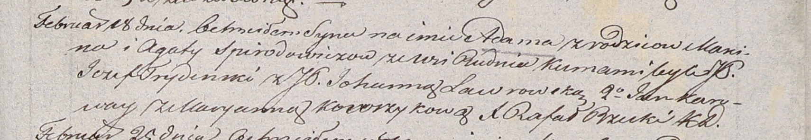

**Спиродович Агата (Spirodowiczowa Agata)**

18 февраля 1806 г -- крещение сына Адама (НИАБ 937-4-32, лист 13,
№4/1806-р).

**НИАБ 937-4-32:** Лист 13. **Метрическая запись №4/1806-р.**

/Спиродовичи/media/image1.png){width="6.496527777777778in"
height="1.1243055555555554in"}

Дедиловичский костел Наисвятейшего Сердца Иисуса. 18 февраля 1806 года.
Метрическая запись о крещении.

Spirodowicz Adam -- сын родителей с деревни Рудня.

Spirodowicz Marcin -- отец.

Spirodowiczowa Agata -- мать.

Trydinski Jezef -- крестный отец, шляхтич.

Ławrowska Johanna -- крестная мать, шляхтянка.

Karoway Jan - ассистент.

Kowrzykowa Maryanna - ассистентка.

Rzucki Rafal -- ксёндз, комендант Дедиловичский.
