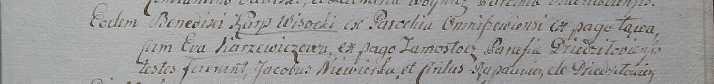

**Высоцкий Карп (Wisocki Karp)**

13 октября 1799 -- венчание с Евой Каржевич с деревни Замосточье (НИАБ
1781-27-199, лист 130, №11/1799-б).

**НИАБ 1781-27-199:** Лист 130. **Метрическая запись №11/1799-б.**

Дедиловичский костел Наисвятейшего Сердца Иисуса. 13 октября 1799 года.
Метрическая запись о венчании.

Wisocki Karp -- жених, с парохии Омнишевской, с деревни Лонва.

Karzewiczowa Ewa -- невеста, с деревни Замосточье, парохии
Дедиловичской.

Niewerka Jakob -- свидетель.

Rapacewicz Cirilus -- свидетель, с деревни Дедиловичи.

Linhart Hyacinthus -- ксёндз.
