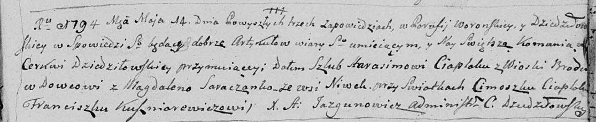

**Цяпляк Гарасим (Ciaplak Harasim)**

14 мая 1794 г -- вдовец, венчание со вдовой Сорокой Магдаленой с деревни
Нивки (НИАБ 136-13-920, лист 1, №4/1794-б (ориг)).

**НИАБ 136-13-896:** Лист 1. **Метрическая запись №4/1794-б (ориг).**

Дедиловичская Покровская церковь. 14 мая 1794 года. Метрическая запись о
венчании.

Ciaplak Harasim -- жених, вдовец, деревня Броды.

Soroczanka Magdalena -- невеста, вдова, деревня Нивки.

Ciaplac Cimoszka -- свидетель.

Kusznirewicz Franciszka -- свидетель.

Jazgunowicz Antoni -- ксёндз.
