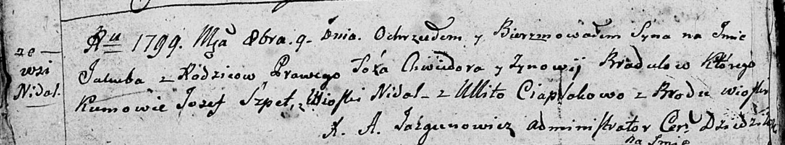

**Цяпляк Зыновия (Ciaplakowa Zynowija)**

9 октября 1799 г -- крестная мать у Марты, дочери Брадульских Хведора и
Зыновии с деревни Недаль (НИАБ 136-13-894, лист 39об, №40/1799-р
(ориг)).

**НИАБ 136-13-896:** Лист 39об. **Метрическая запись №40/1799-р
(ориг).**

{width="6.496527777777778in"
height="1.207580927384077in"}

Дедиловичская Покровская церковь. 9 октября 1799 года. Метрическая
запись о крещении.

Bradul Jakub -- сын родителей с деревни Недаль.

Bradul Chwiedor -- отец.

Bradulowa Zynowija -- мать.

Szpet Jozef -- кум, с деревни Недаль.

Ciaplakowa Ullita, -- кума, с деревни Броды.

Jazgunowicz Antoni -- ксёндз.
