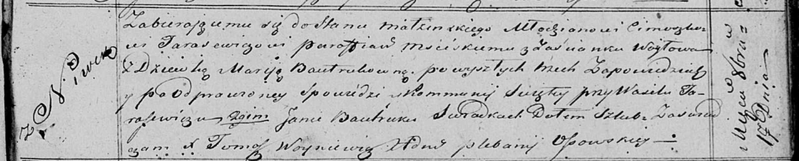

**Тарасевич Цимошка (Tarasewicz Cimoszka)**

17 октября 1820 г -- венчание с девкой Марией Бавтрук с деревни Нивки
(НИАБ 136-13-920, лист 27, №6/1820-б (ориг)).

**НИАБ 136-13-920:** Лист 27. **Метрическая запись №6/1820-б (ориг).**

{width="6.496527777777778in"
height="1.3182141294838146in"}

Осовская Покровская церковь. 17 октября 1820 года. Запись о венчании.

Tarasewicz Cimoszka -- жених, молодой, парафии Мстижской, застенок
Воилово.

Bautrukowna Marija -- невеста, девка, с деревни Нивки.

Tarasewicz Wasil -- свидетель.

Bautruk Jan -- свидетель.

Woyniewicz Tomasz -- ксёндз.
