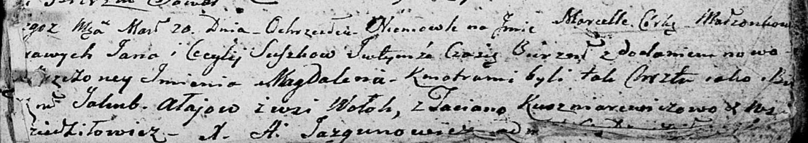

**Авласко Ян (Ałay Jakub)**

20 марта 1804 г -- крестный отец у Марцеллы Магдалены, дочери Сушков Яна
и Цецылии (НИАБ 136-13-894, лист 53, №9/1804-р (ориг)).

**НИАБ 136-13-894:** Лист 53. **Метрическая запись №9/1804-р (ориг).**

Дедиловичская Покровская церковь. 20 марта 1804 года. Метрическая запись
о крещении.

Suszkowna Marcella Magdalena -- дочь.

Suszko Jan -- отец.

Suszkowa Cecylija -- мать.

Ałajow Jakub -- кум, с деревни Волоки.

Kuszniarewiczowa Taciana -- кума, с деревни Дедиловичи.

Jazgunowicz Antoni -- ксёндз.
