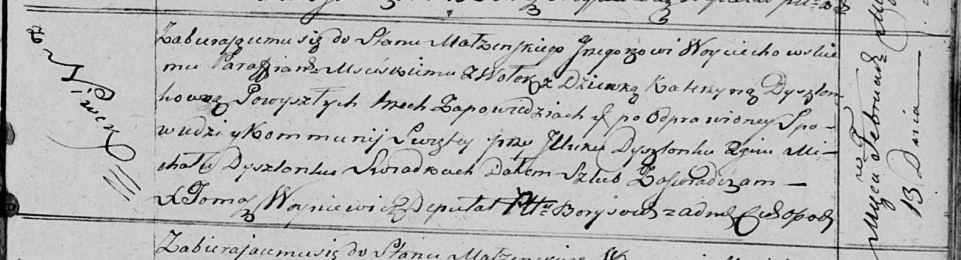

**Войцеховский Иосиф (Woyciechowski Jozef)**

13 февраля 1818 г -- венчание с девкой Катерыной Дышлёнок с деревни
Нивки (НИАБ 136-13-920, лист 25, №3/1818-б (ориг)).

**НИАБ 136-13-920:** Лист 25. **Метрическая запись №3/1818-б (ориг).**

{width="6.496527777777778in"
height="1.7573950131233596in"}

Осовская Покровская церковь. 13 февраля 1818 года. Запись о венчании.

Woyciechowski Jozef -- жених, парафии Мстижской, с деревни Волоки.

Dyszlonkowna Katerzyna -- невеста, девка, с деревни Нивки.

Dyszlonak Jlluk -- свидетель.

Dyszlonak Michał -- свидетель.

Woyniewicz Tomasz -- ксёндз.
