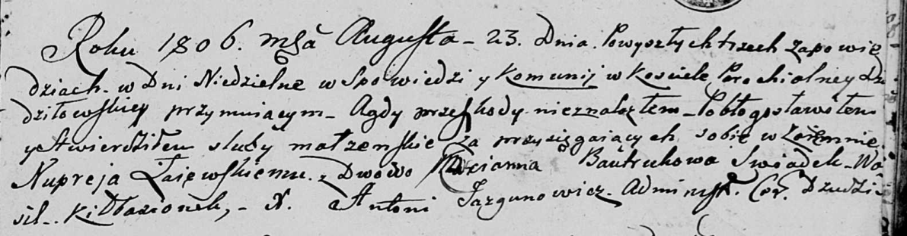

**Лаевский Нупрей (Łajewski Nuprey)**

31 января 1804 г -- свидетель венчания молодого Яна Лаевского с деревни
Волоки с девкой Хведорой Матрашило с деревни Нивки (НИАБ 136-13-920,
лист 10, №2/1804-б (ориг)).

23 августа 1806 г -- венчание с вдовой Марьяной Бавтрук (НИАБ
136-13-920, лист 12, №2/1806-б (ориг)).

**НИАБ 136-13-920:** Лист 10. **Метрическая запись №2/1804-б (ориг).**

Дедиловичская Покровская церковь. 31 января 1804 года. Метрическая
запись о венчании.

Łajеwski Jan -- жених, молодой, с деревни Волоки.

Matryszyłowa Chwiedora -- невеста, девка, с деревни Нивки.

Łajewski Nuprey -- свидетель, с деревни Волоки.

Matraszyła Parachwien -- свидетель.

Jazgunowicz Antoni -- ксёндз.

**НИАБ 136-13-920:** Лист 12. **Метрическая запись №2/1806-б (ориг).**

Дедиловичская Покровская церковь. 23 августа 1806 года. Метрическая
запись о венчании.

Łaiewski Nuprey -- жених, с деревни \[Волоки\].

Bautrukowa Marianna -- невеста, вдова.

Kiłbazionek Wasil -- свидетель.

Jazgunowicz Antoni -- ксёндз.
