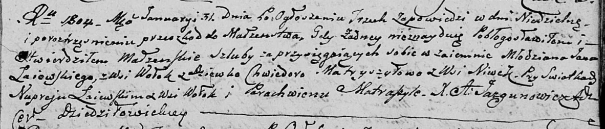

**Лаевский Ян (Łajewski Jan)**

31 января 1804 г -- венчание с девкой Хведорой Матрашило с деревни Нивки
(НИАБ 136-13-920, лист 10, №2/1804-б (ориг)).

**НИАБ 136-13-920:** Лист 10. **Метрическая запись №2/1804-б (ориг).**

Дедиловичская Покровская церковь. 31 января 1804 года. Метрическая
запись о венчании.

Łajеwski Jan -- жених, молодой, с деревни Волоки.

Matryszyłowa Chwiedora -- невеста, девка, с деревни Нивки.

Łajewski Nuprey -- свидетель, с деревни Волоки.

Matraszyła Parachwien -- свидетель.

Jazgunowicz Antoni -- ксёндз.
