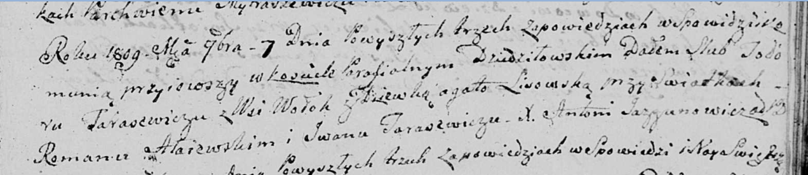

**Тарасевич Тодор (Tarasewicz Todor)**

7 января 1809 г -- венчание с девкой Агатой Лисовской (НИАБ 136-13-920,
лист 16, №19/1809-б (ориг)).

**НИАБ 136-13-920:** Лист 16. **Метрическая запись №19/1809-б (ориг).**

Дедиловичская Покровская церковь. 7 ноября 1809 года. Метрическая запись
о венчании.

Tarasewicz Todor -- жених, с деревни Волоки.

Lisowska Agata -- невеста, девка.

Ałaiewski Roman -- свидетель.

Tarasewicz Jwan -- свидетель.

Jazgunowicz Antoni -- ксёндз.
