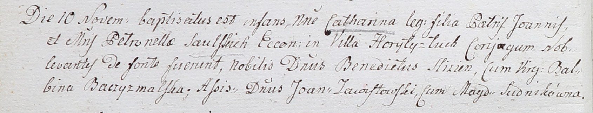
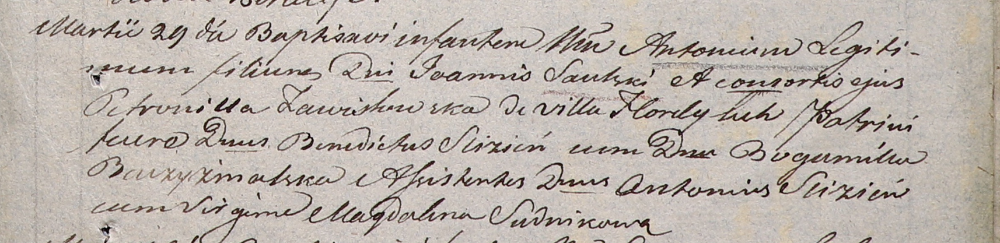

**Саульская (в девичестве Завистовская) Петронеля (Saulska Petronella z
Zawistowskich)**

5 февраля 1801 г -- крещение сына Исидора Иосифа (НИАБ 937-4-32, лист 4,
№6/1801-р).

10 ноября 1802 г -- крещение дочери Катарины (НИАБ 937-4-32, лист 7об,
№34/1802-р).

29 марта 1806 г -- крещение сына Антона (НИАБ 937-4-32, лист 13,
№9/1806-р).

9 февраля 1808 г -- крещение сына Винцентия Иогана (НИАБ 937-4-32, лист
18, №7/1808-р).

**НИАБ 937-4-32:** Лист 4. **Метрическая запись №6/1801-р.**

Дедиловичский костел Наисвятейшего Сердца Иисуса. 5 февраля 1801 года.
Метрическая запись о крещении.

Saulski Jsidor Joseph -- сын вольных людей с двора Горелый Луг.

Saulski Joann -- отец.

Saulska Petronella z Zawistowskich -- мать.

Slizien Benedyct -- крестный отец, шляхтич.

Baczyzmalska Joana -- крестная мать, шляхтянка, девица.

Busz Antoniusz - ассистент, шляхтич.

Baczyzmalska Balbina - ассистентка, шляхтянка, девица.

Linhart Hyacinthus -- ксёндз.

**НИАБ 937-4-32:** Лист 7об. **Метрическая запись №34/1802-р.**

Дедиловичский костел Наисвятейшего Сердца Иисуса. 10 ноября 1802 года.
Метрическая запись о крещении.

Saulska Catharina -- дочь родителей со двора Горелого Луга.

Saulski Joann -- отец, эконом двора Горелый Луг.

Saulska Petronella -- мать.

Slizien Benedict -- крестный отец, шляхтич.

Baczyzmalska Balbina -- крестная мать, шляхтянка.

Zawistowski Joann - ассистент, шляхтич.

Sudnikówna Magdalena - ассистентка, шляхтянка.

Linhart Hyacinthus -- ксёндз.

**НИАБ 937-4-32:** Лист 13. **Метрическая запись №9/1806-р.**

Дедиловичский костел Наисвятейшего Сердца Иисуса. 29 марта 1806 года.
Метрическая запись о крещении.

Saulski Antoni -- сын шляхтичей с деревни \[двора\] Горелый Луг.

Saulski Joann -- отец.

Saulska Petronilla z Zawiszewskich -- мать.

Slizień Benedictus -- крестный отец, шляхтич.

Baczyzmalska Bogumiłła -- крестная мать, шляхтянка.

Slizień Antoni - ассистент, шляхтич.

Sudnikowa Magdalena - ассистентка, девица.

Linhart Hiacinthus -- ксёндз.

**НИАБ 937-4-32:** Лист 18. **Метрическая запись №7/1808-р.**

Дедиловичский костел Наисвятейшего Сердца Иисуса. 9 февраля 1808 года.
Метрическая запись о крещении.

Saulski Vincenti Johan -- сын шляхтичей со двора Горелый Луг.

Saulski Joann -- отец, эконом Горелого Луга.

Saulska Petronilla z Zawistowskich -- мать.

Slizien Antonius -- крестный отец, шляхтич.

Baczyzmalska Johanna -- крестная мать, шляхтянка.

Baczyzmalski Leopoldus - ассистент, шляхтич.

Baczyzmalska Juliana - ассистентка.

Butwiłowski Łukas -- ксёндз, администратор Мстижский.

Jazgunowicz Antoni - ксёндз, администратор Дедиловичский.
