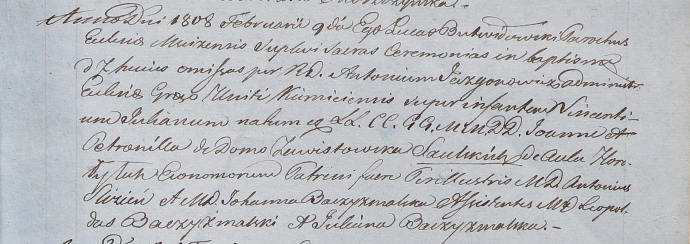

**Саульский Винцентий Иоаннов (Saulski Vincenti Johan)**

9 февраля 1808 г -- крещение (НИАБ 937-4-32, лист 18, №7/1808-р).

**НИАБ 937-4-32:** Лист 18. **Метрическая запись №7/1808-р.**

Дедиловичский костел Наисвятейшего Сердца Иисуса. 9 февраля 1808 года.
Метрическая запись о крещении.

Saulski Vincenti Johan -- сын шляхтичей со двора Горелый Луг.

Saulski Joann -- отец, эконом Горелого Луга.

Saulska Petronilla z Zawistowskich -- мать.

Slizien Antonius -- крестный отец, шляхтич.

Baczyzmalska Johanna -- крестная мать, шляхтянка.

Baczyzmalski Leopoldus - ассистент, шляхтич.

Baczyzmalska Juliana - ассистентка.

Butwiłowski Łukas -- ксёндз, администратор Мстижский.

Jazgunowicz Antoni - ксёндз, администратор Дедиловичский.
