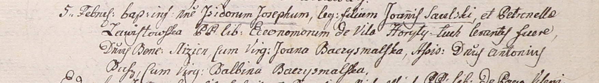

**Саульский Исидор Иоаннов (Saulski Jsidor Joseph)**

5 февраля 1801 г -- крещение сына Исидора Иосифа (НИАБ 937-4-32, лист 4,
№6/1801-р).

**НИАБ 937-4-32:** Лист 4. **Метрическая запись №6/1801-р.**

{width="6.496527777777778in"
height="0.9069444444444444in"}

Дедиловичский костел Наисвятейшего Сердца Иисуса. 5 февраля 1801 года.
Метрическая запись о крещении.

Saulski Jsidor Joseph -- сын вольных людей с двора Горелый Луг.

Saulski Joann -- отец.

Saulska Petronełła z Zawistowskich -- мать.

Slizien Benedyct -- крестный отец, шляхтич.

Baczyzmalska Joana -- крестная мать, шляхтянка, девица.

Busz Antoniusz - ассистент, шляхтич.

Baczyzmalska Balbina - ассистентка, шляхтянка, девица.

Linhart Hyacinthus -- ксёндз.
