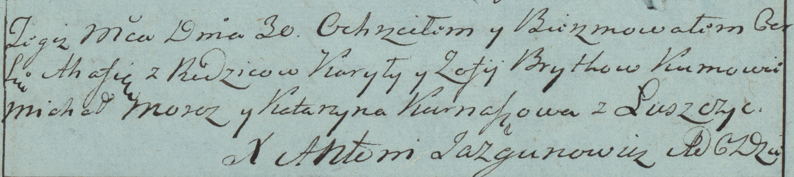

**Бритко Курыла (Brytko Kuryła)**

30 января 1784 г -- крещение дочери Агафии (РГИА 823-2-18, лист 225об,
№3/1784-р (коп)).

**РГИА 823-2-18:** Лист 225об. **Метрическая запись №3/1784-р (коп).**

Дедиловичская Покровская церковь. 30 января 1784 года. Метрическая
запись о крещении.

Brytkowna Ahafia -- дочь родителей с деревни Заречье.

Brytko Kuryła -- отец.

Brytkowa Zofija -- мать.

Moroz Michał -- кум.

Kurnaszowa Katarzyna - кума.

Jazgunowicz Antoni -- ксёндз.
