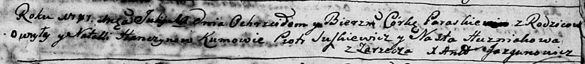

**Ганчик Наталья (Hanczyk Natalla)**

11 июля 1787 г -- крещение дочери Параскевии (НИАБ 136-13-894, лист 2,
№29/1787-р (ориг)).

**НИАБ 136-13-894:** Лист 2. **Метрическая запись №29/1787-р (ориг).**

Дедиловичская Покровская церковь. 11 июля 1787 года. Метрическая запись
о крещении.

Hanczykowna Paraskiewija - дочь родителей с деревни Заречье.

Hanczyk Hawryła -- отец.

Hanczykkowa Natalla -- мать.

Suszkiewicz Piotr -- кум.

Huzniakowa Nasta - кума.

Jazgunowicz Antoniusz -- ксёндз.
