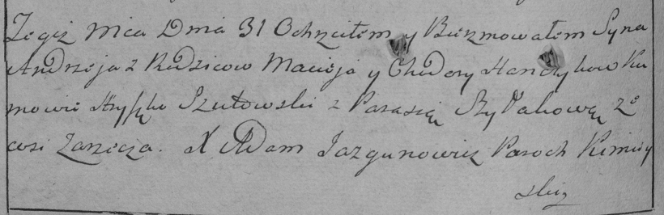

**Ганчик Мацей (Hanczyk Maciey)**

31 августа 1785 г -- крещение сына Андрея (РГИА 823-2-18, лист 229об,
№22/1785-р (коп)).

**РГИА 823-2-18:** Лист 229об. **Метрическая запись №22/1785-р (коп).**

Дедиловичская Покровская церковь. 31 августа 1785 года. Метрическая
запись о крещении.

Hanczyk Andrzey -- сын родителей с деревни Заречье.

Hanczyk Maciey -- отец.

Hanczykowa Chodora -- мать.

Szutowski Hryszko -- кум.

Szyłakowa Parasia - кума.

Jazgunowicz Antoni -- ксёндз.
