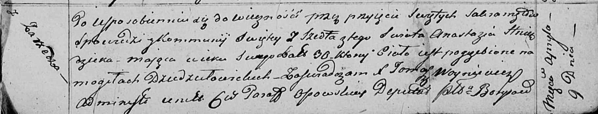

**Гнездицкая Анастасия (Hniazdzicka Anastazia)**

9 апреля 1817 г -- отпевание, умерла в возрасте 30 лет (родилась около
1787 г) (НИАБ 136-13-919, лист 30, №6/1817-у (ориг)).

**НИАБ 136-13-919:** Лист 30. **Метрическая запись №6/1817-у (ориг).**

{width="6.496527777777778in"
height="1.2416666666666667in"}

Осовская униатская церковь. 9 апреля 1817 года. Метрическая запись об
отпевании.

Hniazdzicka Anastazia -- умершая, 30 лет, с деревни Заречье, похоронена
на кладбище деревни Дедиловичи.

Woyniewicz Tomasz -- ксёндз.
