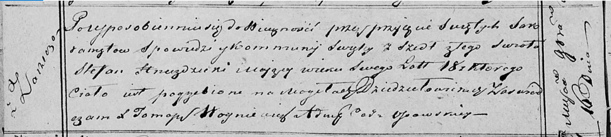

**Гнездицкий Стефан (Hniеzdzicki Stefan)**

16 ноября 1819 г -- отпевание, умер в возрасте 18 лет (родился около
1801 г) (НИАБ 136-13-919, лист 32об, №5/1819-у (ориг)).

**НИАБ 136-13-919:** Лист 32об. **Метрическая запись №5/1819-у (ориг).**

Осовская униатская церковь. 16 ноября 1819 года. Метрическая запись об
отпевании.

Hniezdzicki Stefan -- умерший, 18 лет, с деревни Заречье, похоронен на
кладбище деревни Дедиловичи.

Woyniewicz Tomasz -- ксёндз.
