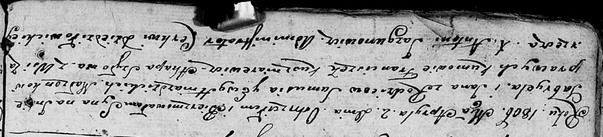

**Гнездицкий Габриэль Самусев (Hniazdzicki Gabriel Jan)**

2 апреля 1806 г -- крещение (НИАБ 136-13-894, лист 59об, №14/1806-р
(ориг)).

**НИАБ 136-13-894:** Лист 59об. **Метрическая запись №14/1806-р
(ориг).**

Дедиловичская Покровская церковь. 2 апреля 1806 года. Метрическая запись
о крещении.

Hniazdzicki Gabryel Jan -- сын родителей с деревни Заречье.

Hniazdzicki Samuś -- отец.

Hniazdzicka Ewa -- мать.

Kuszniarewicz Franciszek -- кум.

Szyłowa Ahapa -- кума.

Jazgunowicz Antoni -- ксёндз.
