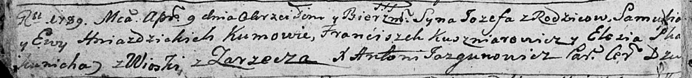

**Гнездицкий Иосиф Самусев (Hniazdzicki Jozef)**

9 апреля 1789 г -- крещение (НИАБ 136-13-894, лист 6об, №21/1789-р
(ориг)).

**НИАБ 136-13-894:** Лист 6об. **Метрическая запись №21/1789-р (ориг).**

Дедиловичская Покровская церковь. 9 апреля 1789 года. Метрическая запись
о крещении.

Hniazdzicki Jozef -- сын родителей с деревни Заречье.

Hniazdzicki Samuś -- отец.

Hniazdzicka Ewa -- мать.

Kuszniarowicz Franćiszek - кум.

Skakunicha Eliesia - кума.

Jazgunowicz Antoni -- ксёндз.
