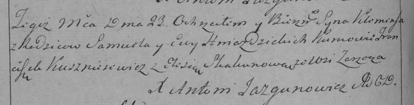

**Гнездицкий Клеменс Самусев (Hniazdzicki Klemens)**

23 ноября 1792 г -- крещение (НИАБ 136-13-894, лист 17об, №77/1792-р
(ориг)), (РГИА 823-2-18, лист 245, №35/1792-р (коп)).

**НИАБ 136-13-894:** Лист 17-об. **Метрическая запись №77/1792-р
(ориг).**

Дедиловичская Покровская церковь. 23 ноября 1792 года. Метрическая
запись о крещении.

Hniazdzicki Klemens -- сын родителей с деревни Заречье.

Hniazdzicki Samuel -- отец.

Hniazdzicka Ewa -- мать.

Kuszniarewicz Franciszek - кум.

Skakunicha Elesia - кума.

Jazgunowicz Antoni -- ксёндз.

**РГИА 823-2-18:** Лист 245об. **Метрическая запись №35/1792-р (коп).**

Дедиловичская Покровская церковь. 23 ноября 1792 года. Метрическая
запись о крещении.

Hnazdzicki Klemens -- сын родителей с деревни Заречье.

Hniazdzicki Samuel -- отец.

Hniazdzicka Ewa -- мать.

Kuszniarewicz Franciszek -- кум.

Skakunowa Elesia -- кума.

Jazgunowicz Antoni -- ксёндз.
