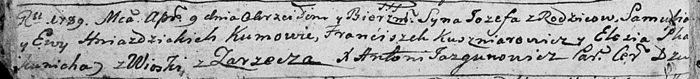
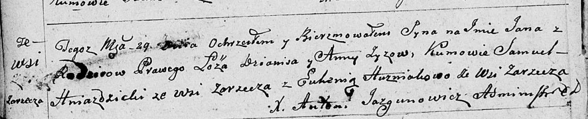
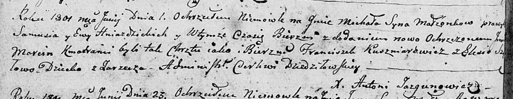

**Гнездицкий Михал Самусев (Hniazdzicki Michał Marcin)**

1 июня 1801 г -- крещение (НИАБ 136-13-894, лист 43об, №14/1801-р
(ориг)).

**НИАБ 136-13-894:** Лист 6об. **Метрическая запись №21/1789-р (ориг).**

Дедиловичская Покровская церковь. 9 апреля 1789 года. Метрическая запись
о крещении.

Hniazdzicki Jozef -- сын родителей с деревни Заречье.

Hniazdzicki Samuś -- отец.

Hniazdzicka Ewa -- мать.

Kuszniarowicz Franćiszek - кум.

Skakunicha Eliesia - кума.

Jazgunowicz Antoni -- ксёндз.

**НИАБ 136-13-894:** Лист 17-об. **Метрическая запись №77/1792-р
(ориг).**

Дедиловичская Покровская церковь. 23 ноября 1792 года. Метрическая
запись о крещении.

Hniazdzicki Klemens -- сын родителей с деревни Заречье.

Hniazdzicki Samuel -- отец.

Hniazdzicka Ewa -- мать.

Kuszniarewicz Franciszek - кум.

Skakunicha Elesia - кума.

Jazgunowicz Antoni -- ксёндз.

**НИАБ 136-13-894:** Лист 25. **Метрическая запись №30/1795-р (ориг).**

Дедиловичская Покровская церковь. 19 августа 1795 года. Метрическая
запись о крещении.

Hniazdzicka Marjana -- дочь родителей с деревни Заречье.

Hniazdzicki Samuś -- отец.

Hniazdzicka Ewa -- мать.

Kuszniarewicz Franciszek - кум.

Skakunowa Elesia - кума.

Jazgunowicz Antoni -- ксёндз.

**НИАБ 136-13-894:** Лист 39об. **Метрическая запись №38/1799-р
(ориг).**

Дедиловичская Покровская церковь. 29 сентября 1799 года. Метрическая
запись о крещении.

Zyz Jan -- сын родителей с деревни Заречье.

Zyz Dzianis -- отец.

Zyzowa Anna -- мать.

Hniazdzicki Samuel -- кум с деревни Заречье.

Huzniakowa Euhenia -- кума с деревни Заречье.

Jazgunowicz Antoni -- ксёндз.

**НИАБ 136-13-894:** Лист 43об. **Метрическая запись №14/1801-р
(ориг).**

Дедиловичская Покровская церковь. 1 июня 1801 года. Метрическая запись о
крещении.

Hniazdzicki Michał Marcin -- сын родителей с деревни Заречье.

Hniazdzicki Samuś -- отец.

Hniazdzicka Ewa -- мать.

Kuszniarewicz Franciszek -- кум.

Szyłowa Elesia -- кума.

Jazgunowicz Antoni -- ксёндз.
