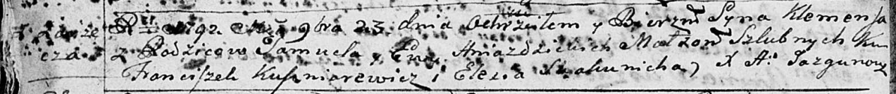

**Гнездицкий Самусь (Hniazdzicki Samuś, Samuel)**

30 января 1788 г -- венчание с Евой Савицкой (НИАБ 136-13-894, лист
66об, №1/1788-б (ориг)).

9 апреля 1789 г -- крещение сына Иосифа (НИАБ 136-13-894, лист 6об,
№21/1789-р (ориг)).

23 ноября 1792 г -- крещение сына Клеменса (НИАБ 136-13-894, лист 17об,
№77/1792-р (ориг)), (РГИА 823-2-18, лист 245, №35/1792-р (коп)).

19 августа 1795 г -- крещение дочери Марьяны (НИАБ 136-13-894, лист 25,
№30/1795-р (ориг)), (РГИА 823-2-18, лист 253, №23/1795-р (коп)).

29 сентября 1799 г -- крестный отец Яна, сына Зызов Дяниса и Анны с
деревни Заречье (НИАБ 136-13-894, лист 39об, №38/1799-р (ориг), НИАБ
136-13-938, лист 244, №36/1799-р (коп)).

1 июня 1801 г -- крещение сына Михала Мартина (НИАБ 136-13-894, лист
43об, №14/1801-р (ориг)).

8 января 1803 г -- крещение сына Антона Адама (НИАБ 136-13-894, лист 49,
№1/1803-р (ориг)).

15 марта 1803 г -- крестный отец Адама Леона, сына Зызов Дяниса и Анны с
деревни Заречье (НИАБ 136-13-894, лист 49об, №8/1803-р (ориг)).

2 января 1805 г -- крестный отец Стефана Стефана, сына Зызов Дяниса и
Анны с деревни Заречье (НИАБ 136-13-894, лист 56, №2/1805-р (ориг)).

2 апреля 1806 г -- крещение сына Габриэля Яна (НИАБ 136-13-894, лист
59об, №14/1806-р (ориг)).

**НИАБ 136-13-894:** Лист 66об. **Метрическая запись №1/1788-б (ориг).**

{width="6.496527777777778in"
height="0.8951246719160105in"}

Дедиловичская Покровская церковь. 30 января 1788 года. Метрическая
запись о венчании.

Hniazdzicki Samuś -- жених с деревни \[Заречье\].

Sawicka Ewa -- невеста, вдова.

Papko Atrachim -- свидетель.

Hniazdzicki Sarhey -- свидетель.

Jazgunowicz Antoni -- ксёндз.

**НИАБ 136-13-894:** Лист 6об. **Метрическая запись №21/1789-р (ориг).**

{width="6.496527777777778in"
height="0.7456025809273841in"}

Дедиловичская Покровская церковь. 9 апреля 1789 года. Метрическая запись
о крещении.

Hniazdzicki Jozef -- сын родителей с деревни Заречье.

Hniazdzicki Samuś -- отец.

Hniazdzicka Ewa -- мать.

Kuszniarowicz Franćiszek - кум.

Skakunicha Eliesia - кума.

Jazgunowicz Antoni -- ксёндз.

**НИАБ 136-13-894:** Лист 17-об. **Метрическая запись №77/1792-р
(ориг).**

{width="6.496527777777778in"
height="0.6946434820647419in"}

Дедиловичская Покровская церковь. 23 ноября 1792 года. Метрическая
запись о крещении.

Hniazdzicki Klemens -- сын родителей с деревни Заречье.

Hniazdzicki Samuel -- отец.

Hniazdzicka Ewa -- мать.

Kuszniarewicz Franciszek - кум.

Skakunicha Elesia - кума.

Jazgunowicz Antoni -- ксёндз.

**РГИА 823-2-18:** Лист 245об. **Метрическая запись №35/1792-р (коп).**

{width="6.496527777777778in"
height="1.6548611111111111in"}

Дедиловичская Покровская церковь. 23 ноября 1792 года. Метрическая
запись о крещении.

Hnazdzicki Klemens -- сын родителей с деревни Заречье.

Hniazdzicki Samuel -- отец.

Hniazdzicka Ewa -- мать.

Kuszniarewicz Franciszek -- кум.

Skakunowa Elesia -- кума.

Jazgunowicz Antoni -- ксёндз.

**НИАБ 136-13-894:** Лист 25. **Метрическая запись №30/1795-р (ориг).**

{width="6.496527777777778in"
height="1.1539402887139107in"}

Дедиловичская Покровская церковь. 19 августа 1795 года. Метрическая
запись о крещении.

Hniazdzicka Marjana -- дочь родителей с деревни Заречье.

Hniazdzicki Samuś -- отец.

Hniazdzicka Ewa -- мать.

Kuszniarewicz Franciszek - кум.

Skakunowa Elesia - кума.

Jazgunowicz Antoni -- ксёндз.

**РГИА 823-2-18:** Лист 253. **Метрическая запись №23/1795-р (коп).**

{width="6.496527777777778in"
height="1.6506944444444445in"}

Дедиловичская Покровская церковь. 19 августа 1795 года. Метрическая
запись о крещении.

Hniazdzicka Marjana -- дочь родителей с деревни Заречье.

Hniazdzicki Samuś -- отец.

Hniazdzicka Ewa -- мать.

Kusznierewicz Franciszek -- кум.

Skakunowa Elesia -- кума.

Jazgunowicz Antoni -- ксёндз.

**НИАБ 136-13-894:** Лист 39об. **Метрическая запись №38/1799-р
(ориг).**

{width="6.496527777777778in"
height="1.3195548993875765in"}

Дедиловичская Покровская церковь. 29 сентября 1799 года. Метрическая
запись о крещении.

Zyz Jan -- сын родителей с деревни Заречье.

Zyz Dzianis -- отец.

Zyzowa Anna -- мать.

Hniazdzicki Samuel -- кум с деревни Заречье.

Huzniakowa Euhenia -- кума с деревни Заречье.

Jazgunowicz Antoni -- ксёндз.

**НИАБ 136-13-938:** Лист 244. **Метрическая запись №36/1799-р (коп).**

(См. тж. НИАБ 136-13-894, лист 39об, №38/1799-р (ориг); РГИА 823-2-18,
лист 271, №33/1799-р (коп))

{width="6.496527777777778in"
height="2.6125in"}

Дедиловичская Покровская церковь. 29 сентября 1799 года. Метрическая
запись о крещении.

Zyz Jan Piotr -- сын родителей с деревни Заречье.

Zyz Dzianis -- отец.

Zyzowa Anna -- мать.

Hniazdzicki Samuś -- кум, с деревни Заречье.

Huzniakowa Euhenia - кума, с деревни Дедиловичи \[Заречье\].

Jazgunowicz Antoni -- ксёндз.

**НИАБ 136-13-894:** Лист 43об. **Метрическая запись №14/1801-р
(ориг).**

{width="6.496527777777778in"
height="1.2565277777777777in"}

Дедиловичская Покровская церковь. 1 июня 1801 года. Метрическая запись о
крещении.

Hniazdzicki Michał Marcin -- сын родителей с деревни Заречье.

Hniazdzicki Samuś -- отец.

Hniazdzicka Ewa -- мать.

Kuszniarewicz Franciszek -- кум.

Szyłowa Elesia -- кума.

Jazgunowicz Antoni -- ксёндз.

**НИАБ 136-13-894:** Лист 49. **Метрическая запись №1/1803-р (ориг).**

{width="6.496527777777778in"
height="1.914963910761155in"}

Дедиловичская Покровская церковь. 8 января 1803 года. Метрическая запись
о крещении.

Hniazdzicki Antoni Adam -- сын родителей с деревни Заречье.

Hniazdzicki Samuel -- отец.

Hniazdzicka Ewa -- мать.

Kuszniarewicz Franciszek -- кум, с деревни Дедиловичи.

Szydłowska Elena -- кума, с деревни Васильковка.

Jazgunowicz Antoni -- ксёндз.

**НИАБ 136-13-894:** Лист 49об. **Метрическая запись №8/1803-р (ориг).**

{width="6.496527777777778in"
height="1.5300940507436571in"}

Дедиловичская Покровская церковь. 15 марта 1803 года. Метрическая запись
о крещении.

Zyz Adam Leon -- сын родителей с деревни Заречье.

Zyz Dzianis -- отец.

Zyzowa Anna -- мать.

Hniazdzicki Samuel -- кум, с деревни Заречье.

Huzniakowa Euhenija -- кума, с деревни Заречье.

Jazgunowicz Antoni -- ксёндз.

**НИАБ 136-13-894:** Лист 56. **Метрическая запись №2/1805-р (ориг).**

{width="6.496527777777778in"
height="1.0748206474190727in"}

Дедиловичская Покровская церковь. 2 января 1805 года. Метрическая запись
о крещении.

Zyz Stefan Stefan -- сын родителей с деревни Заречье.

Zyz Dzianis -- отец.

Zyzowa Anna -- мать.

Hniazdzicki Samuś -- кум, с деревни Заречье.

Huzniakowa Euhenija -- кума, с деревни Заречье.

Jazgunowicz Antoni -- ксёндз.

**НИАБ 136-13-894:** Лист 59об. **Метрическая запись №14/1806-р
(ориг).**

{width="6.496527777777778in"
height="1.4838287401574803in"}

Дедиловичская Покровская церковь. 2 апреля 1806 года. Метрическая запись
о крещении.

Hniazdzicki Gabryel Jan -- сын родителей с деревни Заречье.

Hniazdzicki Samuś -- отец.

Hniazdzicka Ewa -- мать.

Kuszniarewicz Franciszek -- кум.

Szyłowa Ahapa -- кума.

Jazgunowicz Antoni -- ксёндз.
