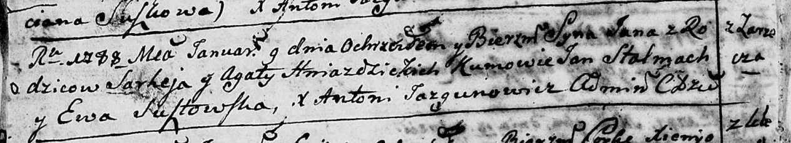

**Гнездицкий Сергей (Hniazdzicki Sarhey)**

9 января 1788 г -- крещение сына Яна (НИАБ 136-13-894, лист 3об,
№6/1788-р (ориг)).

**НИАБ 136-13-894:** Лист 3об. **Метрическая запись №6/1788-р (ориг).**

{width="6.496527777777778in"
height="1.1767366579177603in"}

Дедиловичская Покровская церковь. 9 января 1788 года. Метрическая запись
о крещении.

Hniazdzicki Jan -- сын родителей с деревни Заречье.

Hniazdzicki Sarhej -- отец.

Hniazdzicka Agata -- мать.

Stalmach Jan - кум.

Susztowska Ewa - кума.

Jazgunowicz Antoniusz -- ксёндз.
