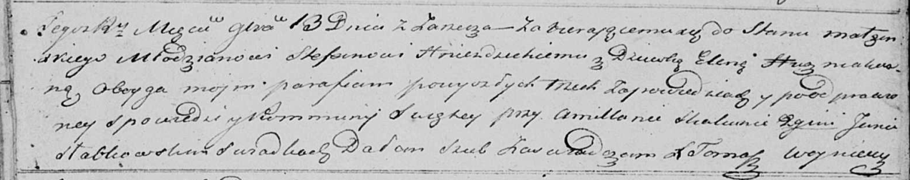

**Гнездицкая (в девичестве Гузняк) Елена (Hniazdzicka Elena z
Huzniakow)**

13 ноября 1821 г -- венчание с молодым Стефаном Гнездицким с деревни
Заречье (НИАБ 136-13-920, лист 28об, №9/1821-б (ориг)).

**НИАБ 136-13-920:** Лист 28об. **Метрическая запись №9/1821-б (ориг).**

Осовская Покровская церковь. 13 ноября 1821 года. Запись о венчании.

Hniezdzicki Stefan -- жених, молодой, парафии Осовской, с деревни
Заречье.

Huzniakowna Elena -- невеста, девка, парафии Осовской.

Skakunec Amillan -- свидетель.

Słabkowski Jan -- свидетель.

Woyniewicz Tomasz -- ксёндз.
