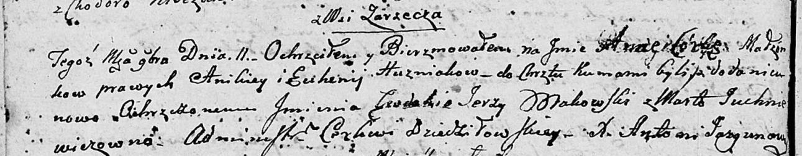

**Гузняк Анна Аникеева (Huzniakowna Anna Ewdokija)**

11 ноября 1802 г -- крещение дочери Анны Евдокии (НИАБ 136-13-894, лист
48об, №41/1802-р (ориг)).

**НИАБ 136-13-894:** Лист 48об. **Метрическая запись №41/1802-р
(ориг).**

{width="6.496527777777778in"
height="1.2732895888013998in"}

Дедиловичская Покровская церковь. 11 ноября 1802 года. Метрическая
запись о крещении.

Huzniakowna Anna Ewdokija -- дочь родителей с деревни Заречье.

Huzniak Anikiey -- отец.

Huzniakowa Euhenija -- мать.

Makowski Jerzy -- кум.

Juchniewiczowna Marta -- кума.

Jazgunowicz Antoni -- ксёндз.
