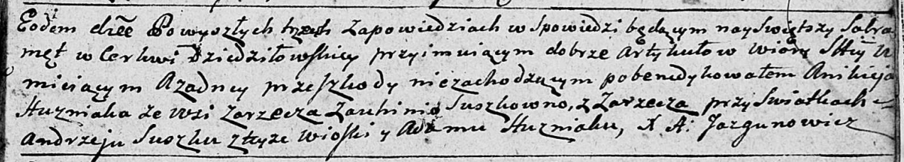
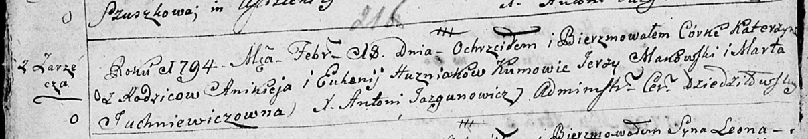
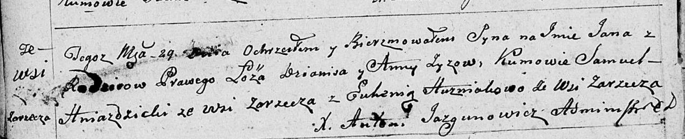
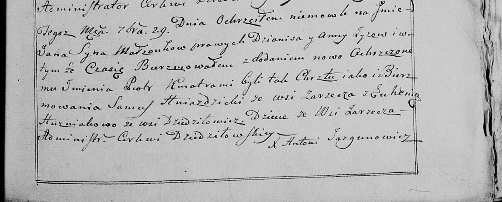
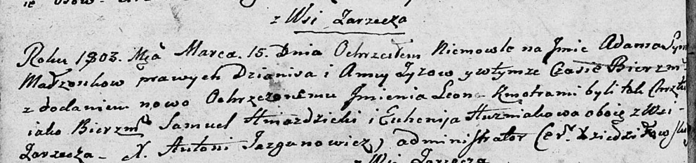
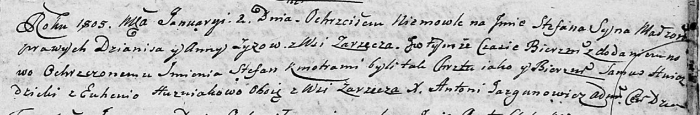

**Гузняк (Сушко) Евгения (Huzniakowa Euhenija z Suszkow)**

7 октября 1792 г -- венчание с Аникеем Гузняком с деревни Заречье (НИАБ
136-13-894, лист 71, №15/1792-б (ориг)).

18 февраля 1794 г -- крещение дочери Катерины (НИАБ 136-13-894, лист
21об, №9/1794-р (ориг)).

29 сентября 1799 г -- крестная мать Яна, сына Зызов Дяниса и Анны с
деревни Заречье (НИАБ 136-13-894, лист 39об, №38/1799-р (ориг), НИАБ
136-13-938, лист 244, №36/1799-р (коп)).

11 ноября 1802 г -- крещение дочери Анны Евдокии (НИАБ 136-13-894, лист
48об, №41/1802-р (ориг)).

15 марта 1803 г -- крестная мать Адама Леона, сына Зызов Дяниса и Анны с
деревни Заречье (НИАБ 136-13-894, лист 49об, №8/1803-р (ориг)).

2 января 1805 г -- крестная мать Стефана Стефана, сына Зызов Дяниса и
Анны с деревни Заречье (НИАБ 136-13-894, лист 56, №2/1805-р (ориг)).

2 апреля 1806 г -- крещение сына Яна (НИАБ 136-13-894, лист 60,
№15/1806-р (ориг)).

**НИАБ 136-13-894:** Лист 71. **Метрическая запись №15/1792-б (ориг).**

Дедиловичская Покровская церковь. 7 октября 1792 года. Метрическая
запись о венчании.

Huzniak Anikiey -- жених, с деревни Заречье.

Suszkowna Auhima \[Euhenia\] -- невеста, с деревни Заречье.

Suszko Andrzey -- свидетель, с деревни Заречье.

Huzniak Adam -- свидетель.

Jazgunowicz Antoni -- ксёндз.

**НИАБ 136-13-894:** Лист 21-об. **Метрическая запись №9/1794-р
(ориг).**

Дедиловичская Покровская церковь. 18 февраля 1794 года. Метрическая
запись о крещении.

Huzniakowna Katerzyna -- дочь родителей с деревни Заречье.

Huzniak Anikiey -- отец.

Huzniakowa Euhenija -- мать.

Makowski Jerzy - кум.

Juchniewiczowna Marta - кума.

Jazgunowicz Antoni -- ксёндз.

**НИАБ 136-13-894:** Лист 39об. **Метрическая запись №38/1799-р
(ориг).**

Дедиловичская Покровская церковь. 29 сентября 1799 года. Метрическая
запись о крещении.

Zyz Jan -- сын родителей с деревни Заречье.

Zyz Dzianis -- отец.

Zyzowa Anna -- мать.

Hniazdzicki Samuel -- кум с деревни Заречье.

Huzniakowa Euhenia -- кума с деревни Заречье.

Jazgunowicz Antoni -- ксёндз.

**НИАБ 136-13-938:** Лист 244. **Метрическая запись №36/1799-р (коп).**

(См. тж. НИАБ 136-13-894, лист 39об, №38/1799-р (ориг); РГИА 823-2-18,
лист 271, №33/1799-р (коп))

Дедиловичская Покровская церковь. 29 сентября 1799 года. Метрическая
запись о крещении.

Zyz Jan Piotr -- сын родителей с деревни Заречье.

Zyz Dzianis -- отец.

Zyzowa Anna -- мать.

Hniazdzicki Samuś -- кум, с деревни Заречье.

Huzniakowa Euhenia - кума, с деревни Дедиловичи \[Заречье\].

Jazgunowicz Antoni -- ксёндз.

**НИАБ 136-13-894:** Лист 48об. **Метрическая запись №41/1802-р
(ориг).**

Дедиловичская Покровская церковь. 11 ноября 1802 года. Метрическая
запись о крещении.

Huzniakowna Anna Ewdokija -- дочь родителей с деревни Заречье.

Huzniak Anikiey -- отец.

Huzniakowa Euhenija -- мать.

Makowski Jerzy -- кум.

Juchniewiczowna Marta -- кума.

Jazgunowicz Antoni -- ксёндз.

**НИАБ 136-13-894:** Лист 49об. **Метрическая запись №8/1803-р (ориг).**

Дедиловичская Покровская церковь. 15 марта 1803 года. Метрическая запись
о крещении.

Zyz Adam Leon -- сын родителей с деревни Заречье.

Zyz Dzianis -- отец.

Zyzowa Anna -- мать.

Hniazdzicki Samuel -- кум, с деревни Заречье.

Huzniakowa Euhenija -- кума, с деревни Заречье.

Jazgunowicz Antoni -- ксёндз.

**НИАБ 136-13-894:** Лист 56. **Метрическая запись №2/1805-р (ориг).**

Дедиловичская Покровская церковь. 2 января 1805 года. Метрическая запись
о крещении.

Zyz Stefan Stefan -- сын родителей с деревни Заречье.

Zyz Dzianis -- отец.

Zyzowa Anna -- мать.

Hniazdzicki Samuś -- кум, с деревни Заречье.

Huzniakowa Euhenija -- кума, с деревни Заречье.

Jazgunowicz Antoni -- ксёндз.

**НИАБ 136-13-894:** Лист 60. **Метрическая запись №15/1806-р (ориг).**

Дедиловичская Покровская церковь. 2 апреля 1806 года. Метрическая запись
о крещении.

Huzniak Jan -- сын родителей с деревни Заречье.

Huzniak Anikiey -- отец.

Huzniakowa Euhenija -- мать.

Karańko Prakop -- кум.

Warawiczowa Marta -- кума.

Jazgunowicz Antoni -- ксёндз.
