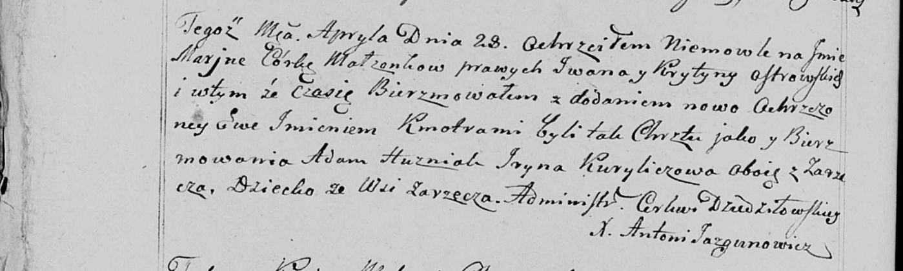
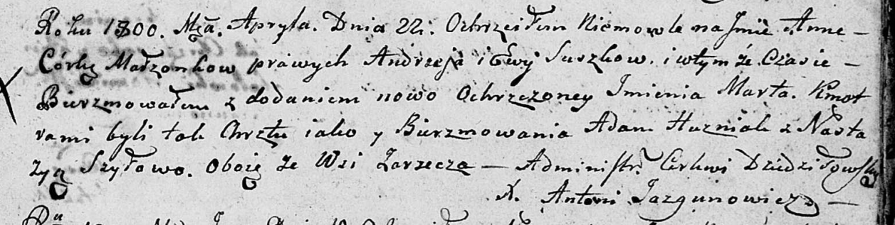
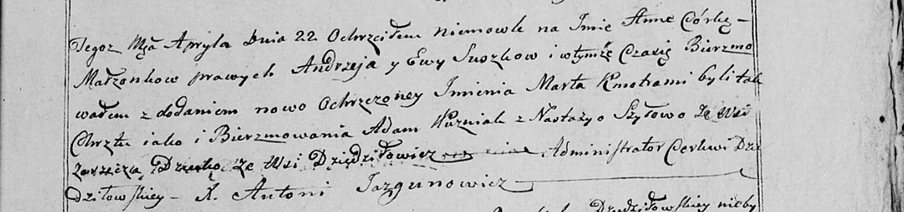
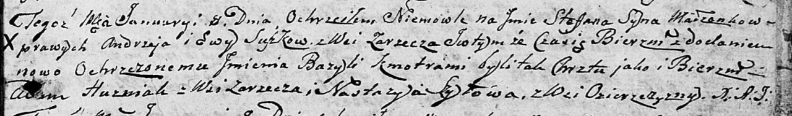

**Гузняк Адам (Huzniak Adam)**

28 апреля 1799 г -- крестный отец Марьяны Евы, дочери Островских Ивана и
Крыстыны с деревни Заречье (НИАБ 136-13-938, лист 241об, №18/1799-р
(коп)).

22 апреля 1800 г -- крестный отец Анны Марты, дочери Сушков Андрея и Евы
с деревни Заречье (НИАБ 136-13-894, лист 41, №14/1800-р (ориг), НИАБ
136-13-949, лист 102, №14/1800-р (коп)).

16 марта 1802 г -- крестный отец Марты Анны, дочери Сушков Андрея и Евы
с деревни Заречье (НИАБ 136-13-894, лист 46, №10/1802-р (ориг)).

8 января 1805 г -- крестный отец Стефана Базыля, сына Сушков Андрея и
Евы с деревни Заречье (НИАБ 136-13-894, лист 56, №5/1805-р (ориг)).

16 июля 1805 г -- крестный отец Элизабеты, дочери Базыля и Хведоры
Слёзков с деревни Дедиловичи (НИАБ 937-4-32, лист 12, №26/1805-р).

**НИАБ 136-13-938:** Лист 241об. **Метрическая запись №18/1799-р
(коп).**

(См. тж. НИАБ 136-13-894, лист 39, №19/1799-р (ориг); РГИА 823-2-18,
лист 269, №19/1799-р (коп))

Дедиловичская Покровская церковь. 28 апреля 1799 года. Метрическая
запись о крещении.

Ostrowska Marjana Ewa -- дочь родителей с деревни Заречье.

Ostrowski Jwan -- отец.

Ostrowska Krystyna -- мать.

Huzniak Adam -- кум, с деревни Заречье.

Kuryliczowa Jryna - кума, с деревни Заречье.

Jazgunowicz Antoni -- ксёндз.

**НИАБ 136-13-894:** Лист 41. **Метрическая запись №14/1800-р (ориг).**

Дедиловичская Покровская церковь. 22 апреля 1800 года. Метрическая
запись о крещении.

Suszkowna Anna Marta -- дочь родителей \[с деревни Заречье\].

Suszko Andrzey -- отец.

Suszkowa Ewa -- мать.

Huzniak Adam -- кум, с деревни Заречье.

Szyłowa Nastazyja -- кума, с деревни Заречье.

Jazgunowicz Antoni -- ксёндз.

**НИАБ 136-13-949:** Лист 102. **Метрическая запись №14/1800-р (коп).**

(См. тж.: НИАБ 136-13-894, лист 41, №14/1800-р (ориг))

Дедиловичская Покровская церковь. 22 апреля 1800 года. Метрическая
запись о крещении.

Suszkowna Anna Marta -- дочь родителей с деревни Дедиловичи \[Заречье\].

Suszko Andrzey -- отец.

Suszkowa Ewa -- мать.

Huznak Adam -- кум, с деревни \[Заречье\].

Szyłowa Nastazya - кума, с деревни Заречье.

Jazgunowicz Antoni -- ксёндз.

**НИАБ 136-13-894:** Лист 46. **Метрическая запись №10/1802-р (ориг).**

Дедиловичская Покровская церковь. 16 марта 1802 года. Метрическая запись
о крещении.

Suszkowna Marta Anna -- дочь родителей \[с деревни Заречье\].

Suszko Andrzey -- отец.

Suszkowa Ewa -- мать.

Huszniak Adam -- кум, с деревни Заречье.

Szyłowa Nastazya -- кума, с деревни Озерщизна.

Jazgunowicz Antoni -- ксёндз.

**НИАБ 136-13-894:** Лист 56. **Метрическая запись №5/1805-р (ориг).**

Дедиловичская Покровская церковь. 8 января 1805 года. Метрическая запись
о крещении.

Suszko Stefan Bazyli -- сын родителей с деревни Заречье.

Suszko Andrzey -- отец.

Suszkowa Ewa -- мать.

Huzniak Adam -- кум, с деревни Заречье.

Szyłowa Nastazya -- кума, с деревни Озерщизна.

Jazgunowicz Antoni -- ксёндз.

**НИАБ 937-4-32:** Лист 12. **Метрическая запись №26/1805-р.**

Дедиловичский костел Наисвятейшего Сердца Иисуса. 16 июля 1805 года.
Метрическая запись о крещении.

Sloskowna Elisabetha -- дочь крестьян с деревни Заречье.

Slosko Basili -- отец.

Sloskowa Theodora -- мать.

Huzniak Adam -- крестный отец, с деревни Заречье.

Szyłowa Auhinia -- крестная мать, с деревни Заречье.

Linhart Hiacinthus -- ксёндз.
