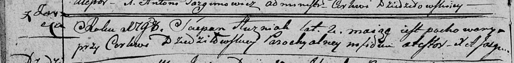

**Гузняк Степан (Huzniak Sciepan)**

30 марта -- 29 июня 1798 г -- отпевание, умер в возрасте 2 лет (родился
около 1796 г) (НИАБ 136-13-919, лист 7об, №9/1798-у (ориг)).

**НИАБ 136-13-894:** Лист 7об. **Метрическая запись №9/1798-у (ориг).**

Дедиловичская Покровская церковь. (30 марта -- 29 июня) 1798 года.
Метрическая запись об отпевании.

Huzniak Sciepan -- умерший, 2 года, с деревни Заречье, похоронен на
кладбище при церкви Дедиловичской.

Jazgunowicz Antoni -- ксёндз.
