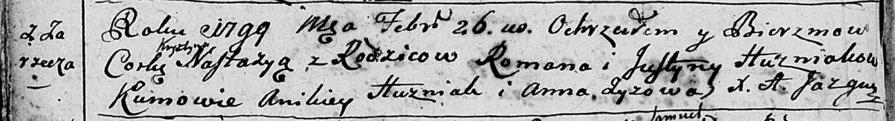
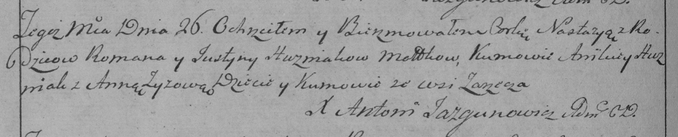
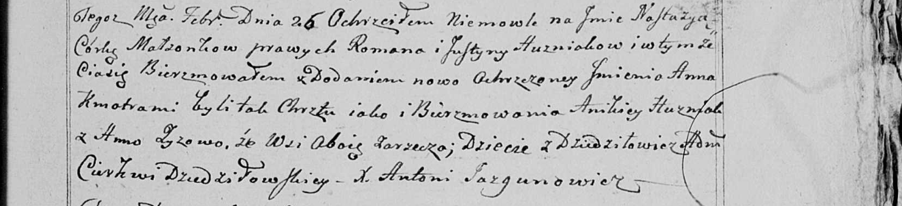

**Гузняк Настасья Романова (Huzniakowna Nastazyia Krystyna)**

26 февраля 1799 г -- крещение (НИАБ 136-13-894, лист 38об, №13/1799-р
(ориг)), (РГИА 823-2-18, лист 268об, №13/1799-р (коп), НИАБ 136-13-938,
лист 241, №13/1799-р (коп)).

**НИАБ 136-13-894:** Лист 38об. **Метрическая запись №13/1799-р
(ориг).**

Дедиловичская Покровская церковь. 26 февраля 1799 года. Метрическая
запись о крещении.

Huzniakowna Nastazyja Krystyna -- дочь родителей с деревни Заречье.

Huzniak Roman -- отец.

Huzniakowa Justyna -- мать.

Huzniak Anikiey-- кум.

Zyzowa Anna -- кума.

Jazgunowicz Antoni -- ксёндз.

**РГИА 823-2-18:** Лист 268об. **Метрическая запись №13/1799-р (коп).**

Дедиловичская Покровская церковь. 26 февраля 1799 года. Метрическая
запись о крещении.

Huzniakowna Nastazya -- дочь родителей с деревни Заречье.

Huzniak Roman -- отец.

Huzniakowa Justyna -- мать.

Huzniak Anikiey -- кум, с деревни Заречье.

Zyzowa Anna -- кума, с деревни Заречье.

Jazgunowicz Antoni -- ксёндз.

**НИАБ 136-13-938:** Лист 241. **Метрическая запись №13/1799-р (коп).**

(См. тж. НИАБ 136-13-894, лист 38об, №13/1799-р (ориг); РГИА 823-2-18,
лист 268об, №13/1799-р (коп))

Дедиловичская Покровская церковь. 26 февраля 1799 года. Метрическая
запись о крещении.

Huzniakowna Nastazya Anna -- дочь родителей с деревни Дедиловичи
\[Заречье\].

Huzniak Roman -- отец.

Huzniakowa Justyna -- мать.

Huzniak Anikiey -- кум, с деревни Заречье.

Zyzowa Anna - кума, с деревни Заречье.

Jazgunowicz Antoni -- ксёндз.
