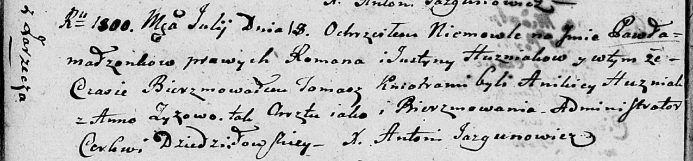
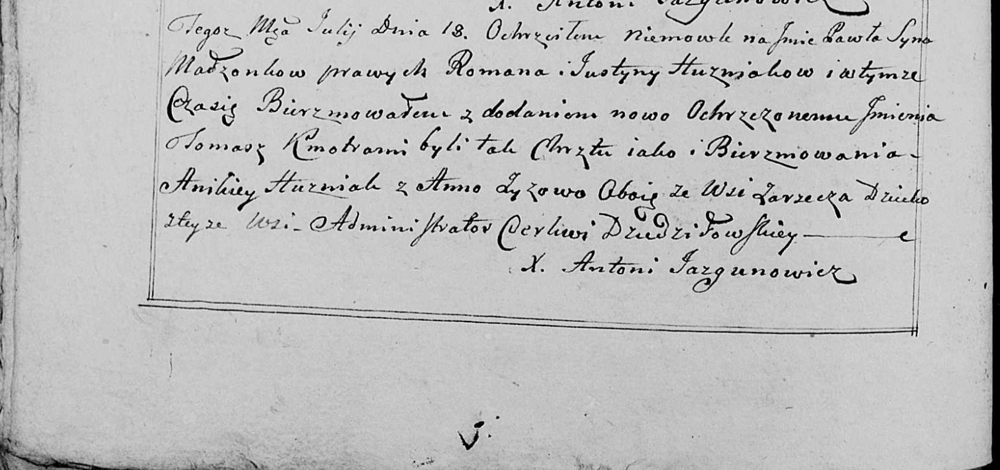

**Гузняк Павел Романов (Huzniak Paweł Tomasz)**

18 июля 1800 г -- крещение (НИАБ 136-13-894, лист 41об, №18/1800-р
(ориг), РГИА 823-2-18, лист 276об, №17/1800-р (коп), НИАБ 136-13-949,
лист 102об, №20/1800-р (коп)).

**НИАБ 136-13-894:** Лист 41об. **Метрическая запись №18/1800-р
(ориг).**

Дедиловичская Покровская церковь. 18 июля 1800 года. Метрическая запись
о крещении.

Huzniak Pawel Tomasz -- сын родителей с деревни Заречье.

Huzniak Roman -- отец.

Huzniakowa Justyna -- мать.

Huzniak Anikiey -- кум.

Zyzowa Anna -- кума.

Jazgunowicz Antoni -- ксёндз.

**РГИА 823-2-18:** Лист 276об. **Метрическая запись №17/1800-р (коп).**

Дедиловичская Покровская церковь. 18 июля 1800 года. Метрическая запись
о крещении.

Huzniak Paweł Marek \[Tomasz\] -- сын родителей с деревни \[Заречье\].

Huzniak Roman -- отец.

Huzniakowa Justyna -- мать.

Huzniak Anikiey -- кум, с деревни Заречье.

Zyzowa Anna -- кума, с деревни Заречье.

Jazgunowicz Antoni -- ксёндз.

**НИАБ 136-13-949:** Лист 102об. **Метрическая запись №20/1800-р
(коп).**

(См. тж.: РГИА 823-2-18, лист 276об, №17/1800-р (коп), НИАБ 136-13-894,
лист 41об, №18/1800-р (ориг))

Дедиловичская Покровская церковь. 18 июля 1800 года. Метрическая запись
о крещении.

Huzniak Paweł Tomasz -- сын родителей с деревни Заречье.

Huzniak Roman -- отец.

Huzniakowa Justyna -- мать.

Huzniak Anikiey -- кум, с деревни Заречье.

Zyzowa Anna - кума, с деревни Заречье.

Jazgunowicz Antoni -- ксёндз.
