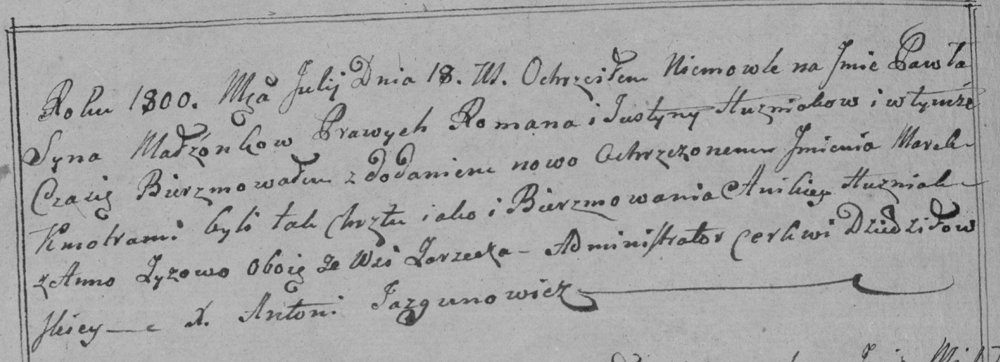

**Гузняк Юстына (Huzniakowa Justyna)**

26 февраля 1799 г -- крещение дочери Настасьи Крыстыны (НИАБ 136-13-894,
лист 38об, №13/1799-р (ориг), РГИА 823-2-18, лист 268об, №13/1799-р
(коп), НИАБ 136-13-938, лист 241, №13/1799-р (коп)).

18 июля 1800 г -- крещение сына Павла Томаша (НИАБ 136-13-894, лист
41об, №18/1800-р (ориг), РГИА 823-2-18, лист 276об, №17/1800-р (коп),
НИАБ 136-13-949, лист 102об, №20/1800-р (коп)).

**НИАБ 136-13-894:** Лист 38об. **Метрическая запись №13/1799-р
(ориг).**

{width="6.496527777777778in"
height="0.8850678040244969in"}

Дедиловичская Покровская церковь. 26 февраля 1799 года. Метрическая
запись о крещении.

Huzniakowna Nastazyja Krystyna -- дочь родителей с деревни Заречье.

Huzniak Roman -- отец.

Huzniakowa Justyna -- мать.

Huzniak Anikiey-- кум.

Zyzowa Anna -- кума.

Jazgunowicz Antoni -- ксёндз.

**РГИА 823-2-18:** Лист 268об. **Метрическая запись №13/1799-р (коп).**

{width="6.496527777777778in"
height="1.3131944444444446in"}

Дедиловичская Покровская церковь. 26 февраля 1799 года. Метрическая
запись о крещении.

Huzniakowna Nastazya -- дочь родителей с деревни Заречье.

Huzniak Roman -- отец.

Huzniakowa Justyna -- мать.

Huzniak Anikiey -- кум, с деревни Заречье.

Zyzowa Anna -- кума, с деревни Заречье.

Jazgunowicz Antoni -- ксёндз.

**НИАБ 136-13-938:** Лист 241. **Метрическая запись №13/1799-р (коп).**

(См. тж. НИАБ 136-13-894, лист 38об, №13/1799-р (ориг); РГИА 823-2-18,
лист 268об, №13/1799-р (коп))

{width="6.496527777777778in"
height="1.4902777777777778in"}

Дедиловичская Покровская церковь. 26 февраля 1799 года. Метрическая
запись о крещении.

Huzniakowna Nastazya Anna -- дочь родителей с деревни Дедиловичи
\[Заречье\].

Huzniak Roman -- отец.

Huzniakowa Justyna -- мать.

Huzniak Anikiey -- кум, с деревни Заречье.

Zyzowa Anna - кума, с деревни Заречье.

Jazgunowicz Antoni -- ксёндз.

**НИАБ 136-13-894:** Лист 41об. **Метрическая запись №18/1800-р
(ориг).**

{width="6.496527777777778in"
height="1.5186953193350832in"}

Дедиловичская Покровская церковь. 18 июля 1800 года. Метрическая запись
о крещении.

Huzniak Pawel Tomasz -- сын родителей с деревни Заречье.

Huzniak Roman -- отец.

Huzniakowa Justyna -- мать.

Huzniak Anikiey -- кум.

Zyzowa Anna -- кума.

Jazgunowicz Antoni -- ксёндз.

**РГИА 823-2-18:** Лист 276об. **Метрическая запись №17/1800-р (коп).**

{width="6.496527777777778in"
height="2.357638888888889in"}

Дедиловичская Покровская церковь. 18 июля 1800 года. Метрическая запись
о крещении.

Huzniak Paweł Marek \[Tomasz\] -- сын родителей с деревни \[Заречье\].

Huzniak Roman -- отец.

Huzniakowa Justyna -- мать.

Huzniak Anikiey -- кум, с деревни Заречье.

Zyzowa Anna -- кума, с деревни Заречье.

Jazgunowicz Antoni -- ксёндз.

**НИАБ 136-13-949:** Лист 102об. **Метрическая запись №20/1800-р
(коп).**

(См. тж.: РГИА 823-2-18, лист 276об, №17/1800-р (коп), НИАБ 136-13-894,
лист 41об, №18/1800-р (ориг))

{width="6.496527777777778in"
height="3.057638888888889in"}

Дедиловичская Покровская церковь. 18 июля 1800 года. Метрическая запись
о крещении.

Huzniak Paweł Tomasz -- сын родителей с деревни Заречье.

Huzniak Roman -- отец.

Huzniakowa Justyna -- мать.

Huzniak Anikiey -- кум, с деревни Заречье.

Zyzowa Anna - кума, с деревни Заречье.

Jazgunowicz Antoni -- ксёндз.
