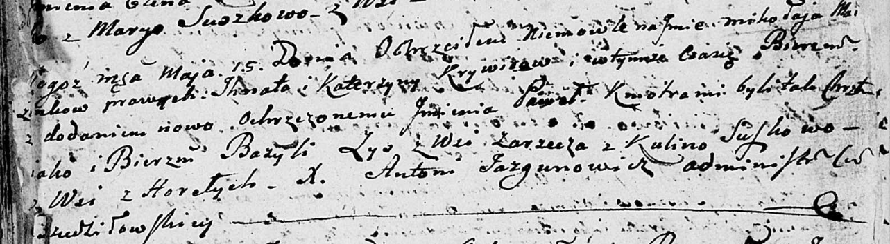
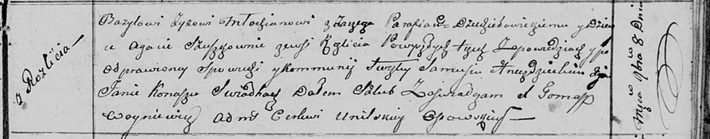

**Зыз Базыль (Zyz Bazyl)**

15 мая 1804 г -- крестный отец у Миколая Павла, сына Зызов Игната и
Катерыны (НИАБ 136-13-894, лист 53об, №13/1804-р (ориг)).

8 ноября 1810 г -- венчание с девкой Агатой Сушко с деревни Разлитье
(НИАБ 136-13-920, лист 17, №8/1810-б (ориг)).

**НИАБ 136-13-894:** Лист 53об. **Метрическая запись №13/1804-р
(ориг).**

Дедиловичская Покровская церковь. 15 мая 1804 года. Метрическая запись о
крещении.

Krywiec Mikolay Paweł -- сын.

Krywiec Jhnat -- отец.

Krywcowa Katerzyna -- мать.

Zys Bazyli -- кум, с деревни Заречье.

Suszkowa Kulina -- кума, с деревни Горелое.

Jazgunowicz Antoni -- ксёндз.

**НИАБ 136-13-920:** Лист 17. **Метрическая запись №8/1810-б (ориг).**

Осовская Покровская церковь. 8 ноября 1810 года. Метрическая запись о
венчании.

Zyz Bazyli -- жених, молодой, парафии Дедиловичской католической, с
деревни Заречье.

Szuszkowna Agata -- невеста, девка, парафии Осовской, с деревни
Разлитье.

Hniazdzicki Samuś -- свидетель.

Konasz Jan -- свидетель.

Woyniewicz Tomasz -- ксёндз.
