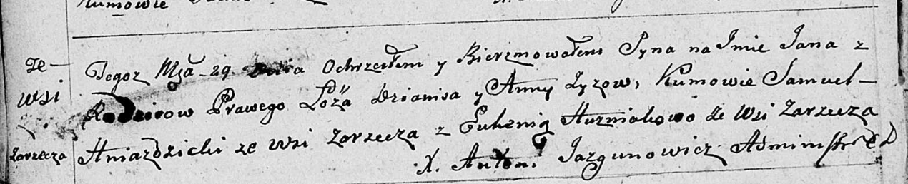

**Зыз Дянис (Zyz Dzianis)**

29 сентября 1799 г -- крещение сына Яна (НИАБ 136-13-894, лист 39об,
№38/1799-р (ориг), РГИА 823-2-18, лист 272, №37/1799-р (коп), НИАБ
136-13-938, лист 244, №36/1799-р (коп)).

15 марта 1803 г -- крещение сына Адама Леона (НИАБ 136-13-894, лист
49об, №8/1803-р (ориг)).

2 января 1805 г -- крещение сына Стефана Стефана (НИАБ 136-13-894, лист
56, №2/1805-р (ориг)).

6 апреля 1808 г -- крещение сына Марцина Иосифа (НИАБ 136-13-894, лист
65, №17/1808-р (ориг)).

**НИАБ 136-13-894:** Лист 39об. **Метрическая запись №38/1799-р
(ориг).**

Дедиловичская Покровская церковь. 29 сентября 1799 года. Метрическая
запись о крещении.

Zyz Jan -- сын родителей с деревни Заречье.

Zyz Dzianis -- отец.

Zyzowa Anna -- мать.

Hniazdzicki Samuel -- кум с деревни Заречье.

Huzniakowa Euhenia -- кума с деревни Заречье.

Jazgunowicz Antoni -- ксёндз.

**РГИА 823-2-18:** Лист 272. **Метрическая запись №37/1799-р (коп).**

Дедиловичская Покровская церковь. 29 сентября 1799 года. Метрическая
запись о крещении.

Zyz Jan -- сын родителей с деревни Заречье.

Zyz Dzianis -- отец.

Zyzowa Anna -- мать.

Hniazdzicki Samuel -- кум, с деревни Заречье.

Huzniakowa Euhenia -- кума, с деревни Заречье.

Jazgunowicz Antoni -- ксёндз.

**НИАБ 136-13-938:** Лист 244. **Метрическая запись №36/1799-р (коп).**

(См. тж. НИАБ 136-13-894, лист 39об, №38/1799-р (ориг); РГИА 823-2-18,
лист 271, №33/1799-р (коп))

Дедиловичская Покровская церковь. 29 сентября 1799 года. Метрическая
запись о крещении.

Zyz Jan Piotr -- сын родителей с деревни Заречье.

Zyz Dzianis -- отец.

Zyzowa Anna -- мать.

Hniazdzicki Samuś -- кум, с деревни Заречье.

Huzniakowa Euhenia - кума, с деревни Дедиловичи \[Заречье\].

Jazgunowicz Antoni -- ксёндз.

**НИАБ 136-13-894:** Лист 49об. **Метрическая запись №8/1803-р (ориг).**

Дедиловичская Покровская церковь. 15 марта 1803 года. Метрическая запись
о крещении.

Zyz Adam Leon -- сын родителей с деревни Заречье.

Zyz Dzianis -- отец.

Zyzowa Anna -- мать.

Hniazdzicki Samuel -- кум, с деревни Заречье.

Huzniakowa Euhenija -- кума, с деревни Заречье.

Jazgunowicz Antoni -- ксёндз.

**НИАБ 136-13-894:** Лист 56. **Метрическая запись №2/1805-р (ориг).**

Дедиловичская Покровская церковь. 2 января 1805 года. Метрическая запись
о крещении.

Zyz Stefan Stefan -- сын родителей с деревни Заречье.

Zyz Dzianis -- отец.

Zyzowa Anna -- мать.

Hniazdzicki Samuś -- кум, с деревни Заречье.

Huzniakowa Euhenija -- кума, с деревни Заречье.

Jazgunowicz Antoni -- ксёндз.

**НИАБ 136-13-894:** Лист 65. **Метрическая запись №17/1808-р (ориг).**

Дедиловичская Покровская церковь. 6 апреля 1808 года. Метрическая запись
о крещении.

Zyz Marcin Jozef -- сын родителей с деревни Заречье.

Zyz Dzianis -- отец.

Zyzowa Anna -- мать.

Hniazdzicki Samuś -- кум.

Kurylinowa Euhenia -- кума.

Jazgunowicz Antoni -- ксёндз.
