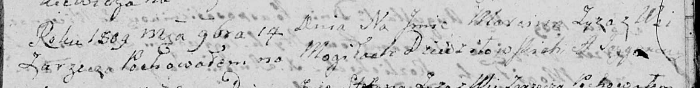

**Зыз Марцин Иосифов (Zyz Marcin Jozef)**

6 апреля 1808 г -- крещение (НИАБ 136-13-894, лист 65, №17/1808-р
(ориг)).

17 ноября 1809 г -- отпевание (НИАБ 136-13-919, лист 21, №19/1809-у
(ориг)).

**НИАБ 136-13-894:** Лист 65. **Метрическая запись №17/1808-р (ориг).**

{width="6.496527777777778in"
height="1.4194597550306212in"}

Дедиловичская Покровская церковь. 6 апреля 1808 года. Метрическая запись
о крещении.

Zyz Marcin Jozef -- сын родителей с деревни Заречье.

Zyz Dzianis -- отец.

Zyzowa Anna -- мать.

Hniazdzicki Samuś -- кум.

Kurylinowa Euhenia -- кума.

Jazgunowicz Antoni -- ксёндз.

**НИАБ 136-13-919:** Лист 21. **Метрическая запись №19/1809-у (ориг).**

{width="6.496527777777778in"
height="0.8229166666666666in"}

Дедиловичская Покровская церковь. 17 ноября 1809 года. Метрическая
запись об отпевании.

Zyz Marcin -- умерший, с деревни Заречье, похоронен на кладбище деревни
Дедиловичи.

Jazgunowicz Antoni -- ксёндз.
