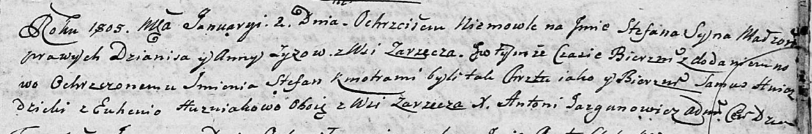
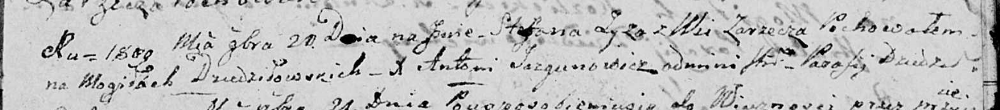

**Зыз Стефан Дянисов (Zyz Stefan Stefan)**

2 января 1805 г -- крещение (НИАБ 136-13-894, лист 56, №2/1805-р
(ориг)).

20 ноября 1809 г -- отпевание (НИАБ 136-13-919, лист 21, №20/1809-у
(ориг)).

**НИАБ 136-13-894:** Лист 56. **Метрическая запись №2/1805-р (ориг).**

Дедиловичская Покровская церковь. 2 января 1805 года. Метрическая запись
о крещении.

Zyz Stefan Stefan -- сын родителей с деревни Заречье.

Zyz Dzianis -- отец.

Zyzowa Anna -- мать.

Hniazdzicki Samuś -- кум, с деревни Заречье.

Huzniakowa Euhenija -- кума, с деревни Заречье.

Jazgunowicz Antoni -- ксёндз.

**НИАБ 136-13-919:** Лист 21. **Метрическая запись №20/1809-у (ориг).**

Дедиловичская Покровская церковь. 20 ноября 1809 года. Метрическая
запись об отпевании.

Zyz Stefan -- умерший, с деревни Заречье, похоронен на кладбище деревни
Дедиловичи.

Jazgunowicz Antoni -- ксёндз.
