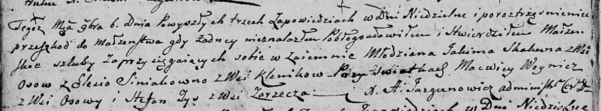

**Зыз Стефан (Zys Stefan)**

6 ноября 1804 г -- свидетель венчания молодого Якима Скакуна с деревни
Осово с Елесей Синяк с деревни Клинники (НИАБ 136-13-920, лист 10об,
№9/1804-б (ориг))

**НИАБ 136-13-920:** Лист 10об. **Метрическая запись №9/1804-б (ориг).**

Дедиловичская Покровская церковь. 6 ноября 1804 года. Метрическая запись
о венчании.

Skakun Jakim -- жених, молодой, с деревни Осовo.

Siniakowna Elesia -- невеста, с деревни Клинники.

Woynicz Macwiey -- свидетель, с деревни Осовo.

Zys Stefan -- свидетель, с деревни Заречье.

Jazgunowicz Antoni -- ксёндз.
